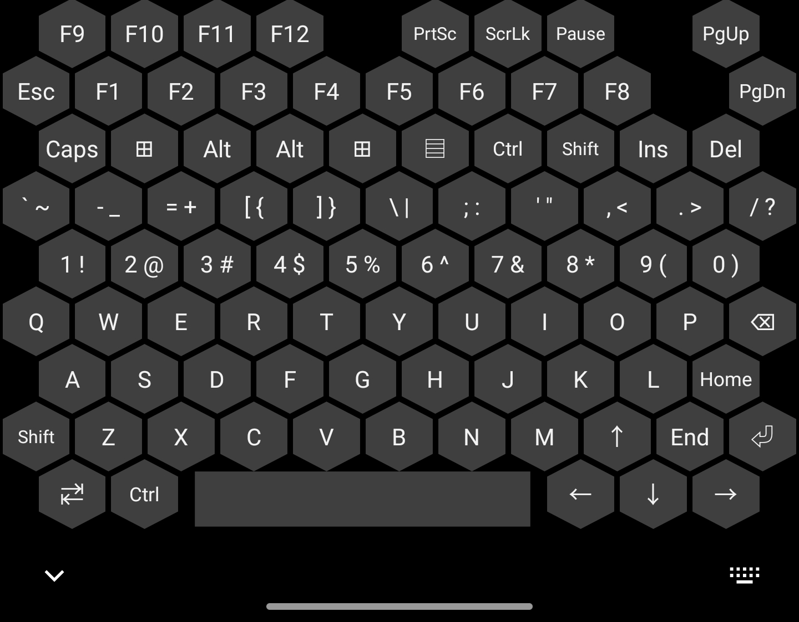

# FullKeyboard

## Overview

FullKeyboard is an IME for Android devices to input keys on a 87-key keyboard.

We already have [Hacker's Keyboard](https://github.com/klausw/hackerskeyboard) in this area. Why another IME?

Recently, I have bought a OnePlus 7T Pro for its full-screen and root capability. Of course, I want to continue to use [Termux](https://github.com/termux/termux-app) and [Microsoft RDP](https://play.google.com/store/apps/details?id=com.microsoft.rdc.android&hl=en_US) the same way as on my BlackBerry Key2. However, there are problems with its modifiers on Microsoft RDP and it is easy to press a wrong key.

As I have built [BlackBerry Key2 Key Extension](https://github.com/IanusInferus/BBK2KeyExtension) for my Key2, I employ the experience to build this IME.

## Functionality

Holding on a key will trigger its keypress multiple times.

Modifiers functions as slow keys, that you can release it and press another normal key to trigger it. Multiple modifiers can be pressed one by one. To trigger a single modifier keypress event, press it twice. You can not trigger a long shortcut.
